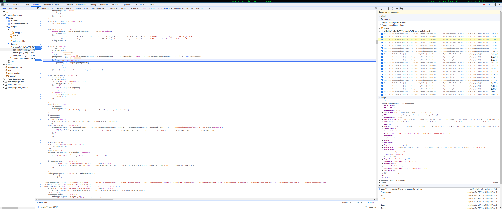

# Devlog

Notes on my findings etc. when trying to RE HKElectric's website.

## Login

The login page is at https://aol.hkelectric.com/AOL/aol#/login?lang=en-US , and asks for the HKElectric account number and password. There is also an iAMSmart option, but I am in fact, dumb, so I won't mess with that.

Trying to login with just values as `username` & `password` , we can capture the request to see what it looks like: it seems like the request payload is encrypted. Here is the cURL equivalent (without headers)

```
curl 'https://aol.hkelectric.com/AOL/api/login/Login' \
  --data-raw '{"EncryptedData":"eyJhbGciOiJSU0EtT0FFUCIsImVuYyI6IkEyNTZHQ00ifQ.DIgSZYGxeUW8JMAqcmzHTntyX6wrpDnrnlx2jUnEUWA0P_Hs7Wv2wb7ZRsZNa1v1qRbxbyP5zbM2JgtylHSdDebArWpajs0rUFQmBhxanvRF5Zw2fqi9IRZ8IVIAu7E6CBDE693nKziFXWNL0h32rTAztwL0lj52FTwLPxggrvlvdQfBR8kftsnBeQUah1dlTY_wB7nxMy9VEpjgpMKQ_HVloQGBKCYQdUnAnMD0qmEifymdTGPpjv-hvpWaqv4qOwUXKmxtvz1rUacpOh2_jCVhwipkzQeJw_e67BcalkTjKR53LE6Ehhi2hHIvvPg5bQxAVjVxk6cUj7rJd4oYtw.G1z1R2SvA8t08lun.jJXUFk6hIVXye0oi828b3nGCbdUJl9UrFPzUzNo7muPEuLfAHhEbLcQw_UqbXkqx44jPHZN8LolnQnT3anP4WlRjsFSV8NMQaFq8r3k5m4mYIaI.RGjcOXZIXn85unBcpSC4Qg"}' \
  --compressed
```

### Figuring out the crypto

Well, it starts with `eyJ`. If you've read my blog, [you'll know why this is exciting](https://saxrag.com/tech/reversing/2022/02/17/ey.html). You might also notice five parts to the string, separated by a dot (`.`). This seems like JWE, but let's decode the header to be sure:

```
$ echo -n 'eyJhbGciOiJSU0EtT0FFUCIsImVuYyI6IkEyNTZHQ00ifQ' | base64 -d
{"alg":"RSA-OAEP","enc":"A256GCM"}base64: invalid input
```

Seems like it is JWE indeed. The "invalid input" is probably just because the padding `=` are removed in the compact JWE representation.

So, we can be pretty sure that the login credentials are encrypted using JWE, with an 256bit AES-GCM CEK (content encryption ey), and a RSA KEK (key encryption key).

### Determining the plaintext payload

Although we know they're using JWE, to be able to replicate this login request locally, we need to determine the format of the plaintext. To do so, we inspect the source of their website, and look for the login URL. After poking around a bit, we find:

```js
    n.login = function() {
        n.hasError = !1;
        showLoadingOverlay();
        var t = !1
          , i = "";
        f.billDateToView == null || angular.isUndefined(f.billDateToView) || f.accountToView == null || angular.isUndefined(f.accountToView) || (t = !0,
        i = f.accountToView);
        e.post("api/login/Login", {
            UserName: n.loginFormData.UserName,
            Password: n.loginFormData.Password,
            isViewBill: t,
            accountToView: i
        }).then(n.loginSuccessFunction, n.loginErrorFunction)
    }
```



So it seems the plaintext should be a JSON object of the form:

```js
{
    UserName: n.loginFormData.UserName,
    Password: n.loginFormData.Password,
    isViewBill: t,
    accountToView: i
}
```

We also know, the actual request has a single key in the payload: `EncryptedData`. Searching for this in the source we find something else interesting:

```js
    aolApp.factory('httpInterceptor', ['$q', '$injector', function ($q, $injector) {
        return {
            request: function (config) {
                var baseUrl = $("base").first().attr("href");
                config.url = baseUrl + config.url;

                config.headers.__RequestVerificationToken =
                    jQuery('input[name="__RequestVerificationToken"]').val();
                config.headers.__AngularJSRequest = "X";
                //document.body.style.cursor = 'wait';

                var deferred = $q.defer();

                if (config.data && !isCsrMode && config.method.toLowerCase() == "post" && window.location.protocol == "https:" && isRequestRequiredEncrypt(config.url)) {
                    var cryptographer = new Jose.WebCryptographer();
                    var public_rsa_key = Jose.Utils.importRsaPublicKey(rsa_key, "RSA-OAEP");
                    var encrypter = new Jose.JoseJWE.Encrypter(cryptographer, public_rsa_key);
                    var strToEncrypt = JSON.stringify(config.data)

                    encrypter.encrypt(strToEncrypt).then(function (result) {
                        if (config.data.CaptchaDeText != null && config.data.CaptchaInputText != null) {
                            config.data = {
                                EncryptedData: result,
                                CaptchaDeText: config.data.CaptchaDeText,
                                CaptchaInputText: config.data.CaptchaInputText
                            }
                        } else {
                            config.data = { EncryptedData: result };
                        }

                        deferred.resolve(config);
                    });

                } else {
                    deferred.resolve(config);
                }

                return deferred.promise;

            },
```

From here, it is evident that they just import their RSA key, and after that the rest of the crypto is left to the library.

### Getting the RSA Key

The RSA key is stored in their source as:

```js
var rsa_key = {
    // n = modulus
    "n": "00:cc:97:48:16:86:2e:d7:c2:cc:06:a2:64:69:12:f6:8c:9b:ff:6d:46:df:71:b4:ba:50:56:30:9e:c6:bc:17:ab:4a:8b:bf:c0:8b:bd:4e:52:53:59:24:b6:4f:b6:30:29:5e:36:ef:77:df:00:7f:85:c4:3e:30:03:ab:20:d2:2d:13:a8:37:23:53:c2:a6:d5:13:cb:dc:b1:26:1b:5f:99:e9:f8:0c:a3:86:69:57:49:30:e9:d7:42:9a:7f:8b:a2:55:8a:fa:0c:ff:d0:fc:20:b8:c6:d5:1c:de:f6:ec:85:00:95:4f:16:f1:5f:67:b5:3c:44:00:6f:b8:d7:c8:52:9b:a6:33:4a:e4:62:36:e6:66:31:c9:44:04:fc:f2:3a:3b:62:99:ba:c9:f7:f9:3a:19:6f:24:2c:46:87:84:e7:b3:eb:41:47:41:56:01:02:fd:5e:a0:2e:a8:ea:2b:48:d1:5f:cd:53:11:f5:e0:c1:3f:80:17:ff:9c:3d:ba:24:98:46:be:0b:75:74:f4:45:38:dd:af:59:ed:73:f8:0a:5a:10:2a:d5:dd:40:7f:c6:b5:7c:15:8e:c9:9e:5e:a0:5a:d9:96:f7:a9:50:72:f1:65:c3:ce:87:ce:22:63:22:d9:ed:fc:34:96:9f:13:83:9e:9d:db:37:8a:33:51:d5",

    // e = publicExponent
    "e": 65537
};   
```

This is in modulus and exponent form, let's convert it to a standard PEM form for maximum compatibility.
